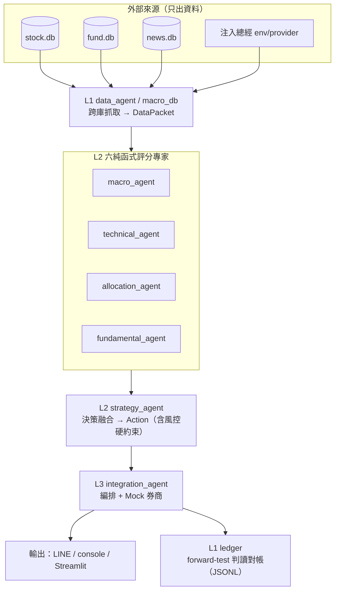

# ARCHITECTURE.md — 2026_strategy_0719 架構地圖

> 規則式多智能體投研與自動交易系統。三個在地 SQLite（stock/fund/news）+ 注入式總經 → 六個**純函式**評分專家融合 → 五級交易行動 → LINE/console/Streamlit 輸出 + append-only forward-test ledger。
> **全系統無 LLM**（判斷全走規則式）。本檔為逆向建立的分層契約 + 職責地圖 + 已知技術債指引。
> 上游來源 repo 只出資料，**判斷全在本 repo**。

---

## 1. 資料流（Data Flow）

**方向鐵律**：依賴一律**向下**（Entry → L3 → L2 → L1 → L0）；UI（L4）→ L3/L2/L0；通知（egress）橫切。**禁止**下層/同層上行 import。

---

## 2. 分層模型（Layer Model）

| 層 | 職責 | 硬規則 |
|---|---|---|
| **L0 Shared/Config** | 常數 / DTO / 純數學 / 路徑（無 I/O） | 不得依賴任何 L1+ |
| **L1 Data/Fetch** | sqlite / HTTP / 檔案 I/O → DTO | 不得 import streamlit 或上層 |
| **L2 Compute** | 純評分函式（無 I/O） | **不得** import requests/urllib/sqlite3/feedparser/streamlit/pandas/numpy |
| **L3 Service** | 編排 / 排程 / 持久化協調 | 只呼叫 L2/L1/L0 |
| **L4 UI/Render** | Streamlit 渲染（委派 view_model） | 不得內嵌評分/抓取邏輯 |
| **Entry / Notification** | 組裝根（run_pipeline/main/dashboard/scripts）/ 輸出 egress（notifications/line_push） | 橫切 |

### 已驗證通過的不變量（grep 實證）
- **六個 L2 評分專家 100% 純**：`macro_agent`/`technical_agent`/`allocation_agent`/`fundamental_agent`/`strategy_agent` + `ledger/reconcile` 內**零** requests/urllib/sqlite3/streamlit/pandas/numpy。
- **`import streamlit` 僅存在於 `ui/` 與 `dashboard.py`**；核心可 headless（cron/NAS）跑。
- **無 L1 data 模組上行** import 進 agents/services/UI。

---

## 3. 模組地圖（Module Map）

判定：**clean** / **god**（多職責）/ **mixed**（跨層）/ **misplaced**（放錯層）/ **minor**。

### L0 — Shared / Config
| 模組 | 單一職責 | 判定 |
|---|---|---|
| `config.py` | 全域常數 SSOT + TW 時間（`now_tw`/`today_tw`）+ import 時 `_validate_config()` | clean |
| `paths.py` | 檔案路徑 SSOT（以 repo 根為錨） | clean |
| `multi_agent_system/contracts.py` | 跨 agent DTO + `Action` enum | clean（但不完整 → V5/V6） |
| `multi_agent_system/numerics.py` | 純數學 `clamp`/`linear_map`/`annualized_sharpe` | clean |
| `multi_agent_system/ui/theme.py` | `Palette` 色票 | clean |

### L1 — Data / Fetch
| 模組 | 職責 | 判定 |
|---|---|---|
| `data_agent.py` | 跨庫 sqlite → `DataPacket`；並持有 `_connect_readonly`/`DataSourceError` | minor（抓取 + 輕度衍生 → V8/V10） |
| `macro_db.py` | sqlite → `MacroReading`/`TwMacroReading`/`TwNightReading` | clean（重用 `_connect_readonly` 私有符號） |
| `macro_providers.py` | Provider Protocol + Static/Simulated/Db/Fred（skeleton） | clean（ports/adapters） |
| `github_store.py` | GitHub Contents-API 訂閱清單持久化 | clean（在 V7 循環中） |
| `subscribers.py` | 訂閱者儲存：DTO-map + 遷移 + 授權 + `JsonSubscriberStore` + factory | god（輕）+ 循環（V7） |
| `pipeline/freshness.py` | sqlite `MAX(date)` 新鮮度守門 | clean（重刻 readonly idiom → V10） |
| `pipeline/watchlist.py` | `WatchItem` DTO + `load_db_paths(env)` + pandas DF↔item | mixed/misplaced（V6） |
| `ledger/store.py` / `stock_store.py` | Append-only JSONL 持久化 | clean（樣板重複 → SSOT Cluster 4） |

### L2 — Compute（純評分，grep 實證無 I/O）
| 模組 | 職責 | 判定 |
|---|---|---|
| `macro_agent.py` | 總經健康分數 ∈[0,1] | clean |
| `technical_agent.py` | D3 順勢+回檔技術分數 | clean |
| `allocation_agent.py` | MPT/Sharpe + 集中度風控 | clean |
| `fundamental_agent.py` | 財務品質分數 | clean |
| `strategy_agent.py` | 決策融合 → `Action`（+ 風控 override） | minor（繞過 `numerics.clamp` → V9） |
| `ledger/reconcile.py` | forward-test 對帳（PIT-safe，純） | clean |
| `ledger/report.py` | 命中率/淨值聚合 **+ `format_report`/`format_equity`** | mixed（L2+文字渲染 → V3） |
| `market_digest.py` | 市場 regime **判讀** + digest **格式化** | mixed + 上行 import（V3/V4） |

### L3 — Service / Orchestration
| 模組 | 職責 | 判定 |
|---|---|---|
| `integration_agent.py` | 編排 **+ 券商/執行 + DTO** | **god（V1）** |
| `pipeline/runner.py` | 排程 **+ 過濾 + 全部 LINE/console 格式化** | **god（V2）** |
| `multiuser.py` | 個人化推播編排 | clean |
| `ledger/recorder.py` / `stock_recorder.py` | 持久化判讀（fail-soft；stock 端 duck-type 避免上耦合） | clean（docstring 誤標「L2」→ V11） |

### 通知（egress，橫切）
| 模組 | 職責 | 判定 |
|---|---|---|
| `notifications.py` | `Notifier` Protocol + `ACTION_EMOJI` + `ConsoleNotifier` | clean |
| `line_push.py` | LINE push（urllib）+ `LineNotifier` | clean |

### L4 — UI / Render
| 模組 | 職責 | 判定 |
|---|---|---|
| `ui/view_model.py` | 純 domain→display 轉換（無 streamlit） | clean |
| `ui/components.py` | Streamlit+altair 渲染（委派 view_model） | clean（除 V5 上行 import） |
| `ui/notify.py` | 通知 re-export + `StreamlitToastNotifier`（lazy st） | clean |
| `dashboard.py` | Streamlit 3-tab app | clean（委派、無內嵌評分） |

### Entry / Scripts
`run_pipeline.py`（CLI 組裝根，lazy import）· `main.py`（demo）· `scripts/seed_demo_dbs.py` · `scripts/nas_line_bot.py`（NAS webhook，刻意直呼 L1 求零相依）· `scripts/ledger_report.py` · `scripts/subscribers_cli.py`。

### 刻意的 lazy-loading（良好設計，非違規）
頂層與 `pipeline/__init__.py` 用 PEP-562 `__getattr__` 讓 NAS webhook 能純 stdlib 跑（免 pandas/numpy）；`macro_providers.DbMacroProvider`、`run_pipeline` 延遲重相依 import；`stock_recorder` duck-type 結果避免 import `integration_agent`。

---

## 4. 技術債狀態（瘦身藍圖執行進度）

分層契約在**要緊處一直被遵守**（純度、核心無 UI、無資料上行依賴）。深層稽核瘦身藍圖執行後：

### ✅ 已解決
- **V1** god-module 拆解：`integration_agent` 只留純編排；券商執行拆出 `broker.py`（BrokerAPI/MockBrokerAPI/maybe_trade）。
- **V5** 核心 DTO 歸位：`OrderReceipt`/`CycleResult` 搬回 `contracts.py`(L0) → 清掉 ui/market_digest/runner 三個上行 import。
- **V6** 核心 DTO 歸位：`WatchItem` 搬回 `contracts.py`(L0) → L1 store 不再 reach 進 pipeline 子套件。
- **V9** `strategy_agent` 改用 `numerics.clamp`（原唯一沒用 numerics 的 agent）。
- **V10** sqlite 唯讀連線 + 識別字白名單抽 `infra/db.py`（安全白名單全專案唯一份）；`data_agent` 不再兼作 db-infra home。
- **V11** ledger recorder/report docstring 層級標籤修正。
- **SSOT 收攏**：`numerics.weighted_mean`（C1）、`macro_db._latest_from`（C3）、`infra/http.request_json`（C2）、`ledger/_jsonl`（C4）、`Action.tone`+`ACTION_EMOJI`（C5）。
- **V7** 依賴循環破除：抽 `subscribers_core.py`（純 helper + Protocol）兩後端共用 → `subscribers` ⇄ `github_store` 唯一循環消失（lazy import 降級為載入最佳化）。
- **V2/V3/V4** 文字渲染層：LINE/console 文字組裝抽出 `render_text/`（`_common`/`run_digest`/`market`/`ledger`，對應 `ui/` 的文字版）→ `pipeline/runner`、`market_digest`、`ledger/report` 回歸純計算；來源模組留 re-export shim 保向後相容，`render_text` 靠 `TYPE_CHECKING` + function-local import 達零上行循環。

### ⏳ 剩餘
- **V8 / V4-評分對齊**：`data_agent` 抓+輕度衍生、`market_digest.market_regime` 與 `macro_agent` 兩套總經評分 —— 低優先、by-design 可接受，待實際需求。

### 新增基底 / 拆分模組
`broker.py`（L3 執行）· `infra/{http,db}.py`（L0/L1 共用 I/O 底層）· `ledger/_jsonl.py`（ledger I/O）· `subscribers_core.py`（訂閱純邏輯）· `render_text/`（文字渲染層，對應 `ui/`）· `paths.py`（落地路徑 SSOT）。

> 稽核基準 2026-07；本節隨瘦身藍圖執行更新。上方 §3 模組地圖為稽核當下快照（V1/V5/V6 後 integration_agent 已非 god、DTO 已歸位 contracts）。
